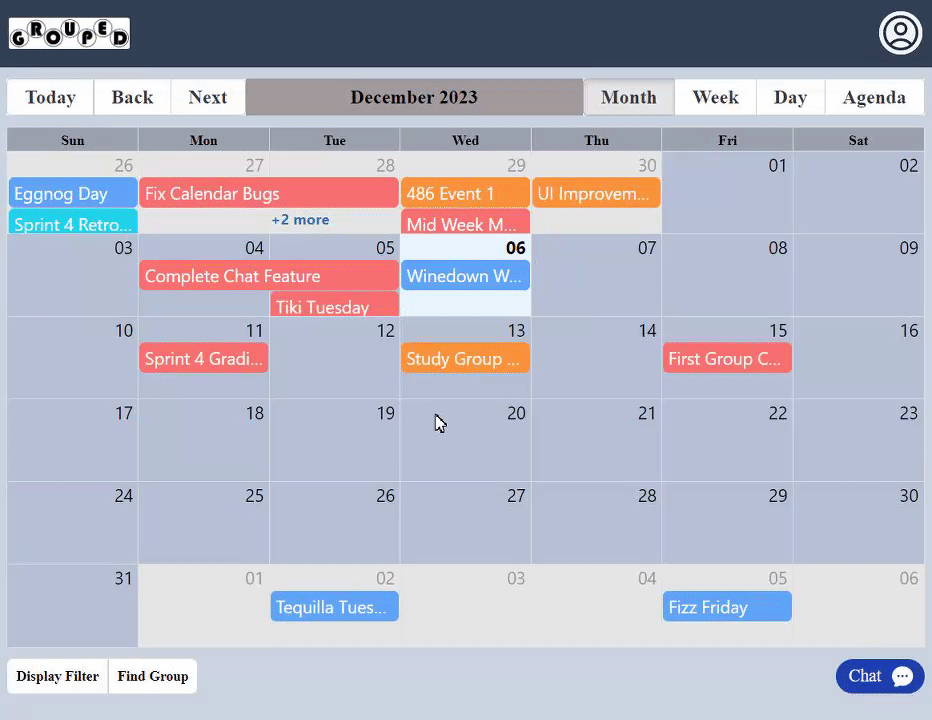

# Grouped

A scheduling platform built for college students. Grouped simplifies the coordination of study sessions, club meetings, and group activities by understanding how students actually work and collaborate.

## Key Features

- **Dynamic Calendar Views**: You can switch between monthly, weekly, and daily views, making it super easy to find a time that works for everyone.
- **Task Management**: Create, assign, and track tasks right within the calendar, so everything stays organized.
- **Real-Time Chat**: Chat with your group in real-time, no need to jump to another app.

## Tech Stack

- **Frontend**: React and TailwindCSS 
- **Backend**: PHP
- **Database**: SQL

## Preview

